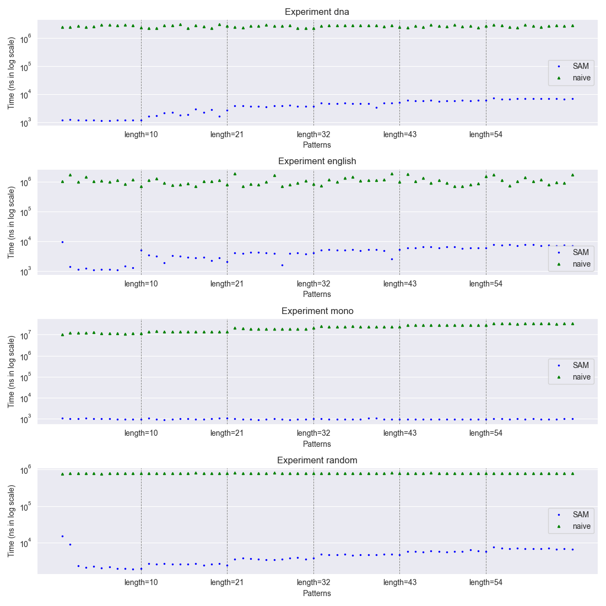
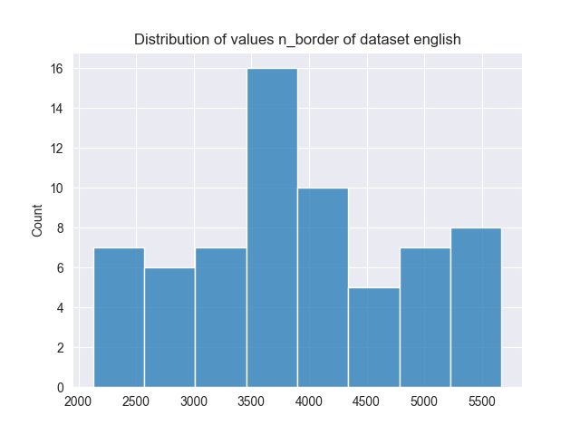
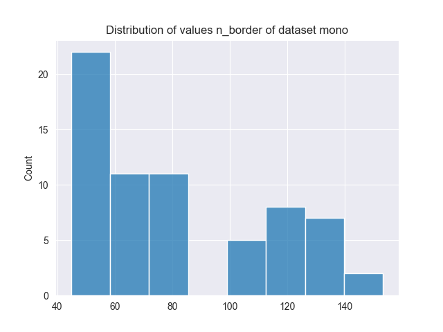
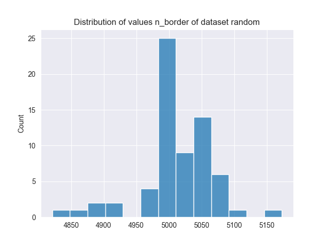

#   Semestral work report B251
-   Implementation Language: **python/cpp**
The implementation was chosen in c++ where results were saved in file. After it, there was made analysis of expereminets in python.

##  Implementation and data structure design
-   What construction algorithm did you choose and why?
I chose the suffix automaton (SA) construction. The suffix automaton can be built in linear time with respect to the length of the input text w, O(|w|). 

Compared to algorithms such as KMP, which require O(|w| + |P|) time for each query of a pattern P, the SA allows searching for a pattern in time O(|P|) after the automaton has been built. Therefore, if we perform multiple queries count() of length |P| on the same text w, the total complexity using a suffix automaton is O(|w| + #queries * |P|), whereas using KMP for each query would result in O(#queries (|w| + |P|)). This makes the suffix automaton more suitable when many patterns are queried against the same text.

-   Did you need any additional computation to answer all of the queries for matching? If yes, what and how did you integrate it? 
Yes. I need additional computation, where I build a suffix automaton over the text in which the pattern is searched.

The construction of the suffix automaton was described in the lecture. Briefly, the input text is read from left to right. For each new character, the automaton is extended according to one of the three standard cases, depending on whether the transition already exists and whether cloning of states is required.

For querying, I first traverse the automaton from the initial state by following transitions corresponding to characters of the pattern P. If at some point a transition does not exist, the pattern does not occur in the text. Otherwise, after reading the whole pattern, I end in a state q.

Each state represents an equivalence class of substrings that have the same set of end positions in the text. Storing all these substrings or all end positions explicitly for every state would be too expensive. Therefore, for each state I store only structural information and compute the required data on demand. To make this possible, I store the reversed suffix-link graph, where each state keeps a list of states for which it is a suffix link. This structure is stored in variable m_reversed_suffix_links.

If I need only to count how many times the pattern P occurs in the text, I use an additional value m_count stored for each state.

After the build phase, for each state in SA corresponding to a prefix, I increment the counter of the state corresponding to the whole prefix ending at that position. After the construction is finished, these values are propagated through suffix links so that m_count[q] represents the end positions of state q. Then, to answer count(P), it is enough to reach the state q corresponding to P and return m_count[q].

If I want to find all indices where the pattern P begins, counting is not sufficient. In this case, starting from the state q, I traverse the reversed suffix-link graph and collect all end positions reachable from this state. These end positions are then converted to starting indices by subtracting |P| - 1. It is necessary to traverse also inner states, because each state represents a whole equivalence class of substrings with the same end positions, not only a single occurrence. Restricting the traversal to leaf states would not, in general, allow reconstruction of all match positions.

-   Did you have any troubles you want to share with your implementation?
More troubles I receive when I need to understand how suffix automaton searchs pattern. 

##  LCF Algorithm design
-   Describe and write pseudocode of your algorithm

The algorithm assumes that the suffix automaton is already built for the first string x. It then processes the second string T, call it y, character by character and simulates its traversal over the automaton. Then we maintain following variables:
            
            v --  the current state in the suffix automaton,
            l --  the length of the current matching substring,
            bestLen -- the maximum length found so far,
            bestEndPositions -- position in T where a substring of length bestLen ends
For each character T[i], we try to follow the corresponding transition from the current state. If the transition does not exist, we repeatedly follow suffix links until either a valid transition is found or we reach the root. During this process, the current length $\ell$ is updated accordingly.

Whenever a longer match is found, if $\ell$ > bestLen, we update bestLen and record the current ending position i. If the match length equals the current maximum, we store the ending position as well.

After scanning the whole string T, we reconstruct all distinct substrings of length bestLen ending at positions stored in bestEndPositions. For each such substring, we call match_all on the suffix automaton to obtain all starting positions in the original text where this substring occurs. All these positions are collected and returned together with bestLen.
    
Pseudocode:
Algorithm LCF(T):

    if m_root is null:
        return (∅, 0)
    
    v ← m_root
    l ← 0
    bestLen ← 0
    bestEndPositions ← empty list

    for i ← 0 to |T| − 1:
        while v ≠ m_root and v.gotoNext(T[i]) = null:
            v ← v.suffix_link
            l ← v.length

        if v.gotoNext(T[i]) ≠ null:
            v ← v.gotoNext(T[i])
            l ← l + 1

        if l > bestLen:
            bestLen ← l
            clear bestEndPositions
            append i to bestEndPositions
        else if l = bestLen and l > 0:
            append i to bestEndPositions

    if bestLen = 0:
        return (∅, 0)

    uniqueSubstrings ← empty set
    for each endPos in bestEndPositions:
        substring ← T[endPos − bestLen + 1 .. endPos]
        insert substring into uniqueSubstrings

    resultPositions ← empty list
    for each substring s in uniqueSubstrings:
        positions ← match_all(s)
        append all positions to resultPositions

    return (resultPositions, bestLen)

-   Analyse time and memory consumption

At first we traverse the pattern T, which takes $\mathcal{O}(|T|)$.
Inside this traversal we sometimes follow suffix links. A very rough bound would be to say that for each character we can traverse up to $\mathcal{O}(|T|)$ suffix links, which would give $\mathcal{O}(|T|^2)$. However, this bound is not tight. In fact, traversing suffix links is amortized $\mathcal{O}(1)$ per processed character of T, hence the whole traversal phase is $\mathcal{O}(|T|)$.

We argue the amortization as follows. Each time we follow a suffix link, the current matched length $\ell$ decreases, because suffix links always go to a state with strictly smaller m_length. Therefore, applying a suffix link decreases $\ell$ by at least 1, and $\ell$ is always non-negative. On the other hand, during the scan of T, $\ell$ is increased only when we successfully take a transition by the next character, and this can happen at most once per processed character, at most |T| times in total. Since the number of decreases cannot exceed the number of increases, the total number of suffix-link traversals over the whole algorithm is $\mathcal{O}(|T|)$.
Therefore, the total time of the traversal phase is $\mathcal{O}(|T|)$.

After that, we reconstruct substrings of length bestLen. In the worst case, there can be $\mathcal{O}(|T|)$ positions in bestEndPositions, and creating one substring costs $\mathcal{O}(\text{bestLen})$. 
Therefore, this part takes $\mathcal{O}(|T| \cdot \text{bestLen}).$

Then we call match_all for each distinct longest substring. Let k be the number of such substrings and let $occ_i$ be the number of occurrences reported for substring $s_i$. 
The cost of each call is $\mathcal{O}(|s_i| + occ_i)$, so the total cost is $\mathcal{O}\left(\sum_{i=1}^{k} (|s_i| + occ_i)\right).$

Overall time complexity is:
$\mathcal{O}\left(|T| + |T| \cdot \text{bestLen} + \sum_{i=1}^{k}(|s_i| + occ_i)\right).$

During execution we store:

    bestEndPositions: up to O(|T|),
    uniqueSubstrings: up to k strings, each of length `bestLen`, O(k \cdot \text{bestLen}),
    res: output positions of total size sum of all occurences

Therefore, the additional memory usage (besides the suffix automaton itself) is 
$\mathcal{O}\left(|T| + k \cdot \text{bestLen} + \sum_i occ_i\right).$

-   Please, keep your variable name same as in implementation

##  Experiment results
-   Import your graphs from the experiments

-   How the pattern length and the number of occurences in the text inflict the query time?

In the section When does SA pay off compared to the naive approach?, I analyze how many pattern queries are needed for the suffix automaton (SA) to become more efficient than the naive approach. Although the suffix automaton has better asymptotic complexity, in practice the construction time must also be taken into account. For SA, the total time is O(T_{build} + #quries * T_{pattern}). For the naive approach, the total time is O(#queries * |w| * |P|).

The pattern length directly influences the query time in both approaches. In SA, the query time grows linearly with the pattern length, while in the naive approach it is multiplied by the length of the text.

The number of occurrences of the pattern influences the query time mainly when all occurrences need to be reported. In this case, the total running time also depends on the output size, since each occurrence must be processed. Therefore, the number of occurrences can have a stronger impact on the total query time than the pattern length itself.

-   Did you have any troubles you want to share with experiment running and evaluation?

Yes. At the beginning, I misunderstood which operations should be measured in the experiments. I initially thought that for each dataset we should measure the LCF() query. Later, I realized that the experiments are focused on pattern matching queries, sa.count(P) and sa.match_all(P), where match_all(P) returns all indices where the pattern P starts.

Another issue was related to the implementation of LCF(). In my implementation, each time a longer common substring was found, I created a copy of the current substring. This caused a significant slowdown of the algorithm and made LCF() much slower than expected. Because of this overhead, LCF() was not suitable for direct comparison in the experimental evaluation.

##  Conclusion
-   For what kind of queries and data would you recommend Suffix Automaton data structure?

Based on the section When does SA pay off compared to the naive approach?, the suffix automaton is suitable mainly in scenarios with a large number of pattern queries on the same text, where the construction cost can be amortized.

In this work, four types of datasets are considered: dna, english, mono, and random. The conclusions below are based only on the experimental results shown in the section When does SA pay off compared to the naive approach?

For the mono dataset, the suffix automaton outperforms the naive approach once the number of identical queries exceeds approximately 140. Below this threshold, the build cost dominates, while above it the suffix automaton becomes faster.

For the dna dataset, the suffix automaton reaches the break-even point earlier than for the english and random datasets. For a sufficiently large number of queries, SA performs better than the naive approach.

For the english dataset, the break-even point occurs later than for dna and mono. In the range of queries shown in the experiments, the suffix automaton does not provide a clear advantage over the naive approach.

For the random dataset, the suffix automaton does not outperform the naive approach within the measured range of queries.

To summarize, based on the presented experiments, the suffix automaton is recommended for the mono dataset and can be beneficial for the dna dataset when the number of queries is sufficiently large. For the english and random datasets, no advantage of using the suffix automaton was observed in the experiments.ts like dna when many queries are performed. On the other hand, I do not recommend using SA for english or random datasets, where the number of occurrences is low and the build cost does not pay off.

-   Can you just by your words compare SAM with other suffix data structures (Trie, Tree, Array?)

The suffix automaton (SAM) is more compact than a suffix trie and a suffix tree. A suffix trie explicitly stores all suffixes of the text and therefore requires quadratic space in the length of the text, which makes it impractical for larger inputs. The suffix tree is a compressed version of the suffix trie and can be built in linear time and space, but its structure is relatively complex and harder to implement correctly.

Compared to a suffix tree, the suffix automaton stores the same information about substrings but in a more compact form. The number of states in SAM is linear in the length of the text, and the construction is simpler to implement in practice. However, the structure of SAM is less intuitive than that of a suffix tree, especially when it comes to understanding suffix links and state equivalence classes.

A suffix array is another alternative. It is also space-efficient, but queries usually require binary search combined with longest common prefix (LCP) computations.

In summary, the suffix automaton provides a good trade-off between memory usage, query time, and implementation complexity. It is especially suitable when many pattern queries need to be processed on the same text, while suffix arrays and trees may be preferable in scenarios where simpler queries or static preprocessing are sufficient.
